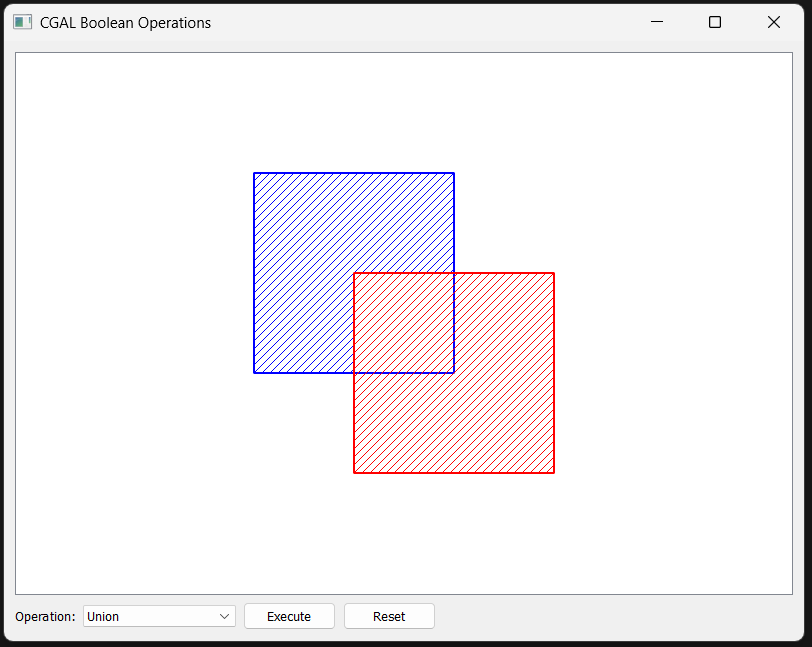

# Polygon Boolean Operations Visualizer



## Overview

Polygon Boolean Operations Visualizer is a desktop application that demonstrates computational geometry operations on polygons using the CGAL library (Computational Geometry Algorithms Library) with a Qt-based graphical interface. This tool allows users to visualize how Boolean operations like union, intersection, difference, and symmetric difference work on polygons.

## Features

- **Multiple Boolean Operations**: Perform union, intersection, difference, and symmetric difference operations on 2D polygons
- **Interactive Visualization**: See the results of operations in real-time with color-coded output
- **Exact Calculations**: Uses CGAL's exact geometric kernel for precise and robust geometric computations
- **Cross-Platform**: Works on Windows, macOS, and Linux
- **Export Capability**: Save results as images or polygon data files

## Demo


**Video Demonstration**: [Watch Demo Video](resources/demovideos/Demovideo.mp4)

## Concepts Used

### Computational Geometry

This application demonstrates several fundamental computational geometry concepts:

1. **2D Polygons**: Closed shapes defined by a sequence of vertices
2. **Boolean Operations on Polygons**:
   - **Union**: Combines two polygons into one (A ∪ B)
   - **Intersection**: Finds the common area between two polygons (A ∩ B)
   - **Difference**: Subtracts one polygon from another (A - B)
   - **Symmetric Difference**: Finds areas in either polygon but not in both (A ⊕ B)
3. **Exact Geometric Computation**: Using exact arithmetic to avoid floating-point errors in geometric calculations

### Libraries and Frameworks

1. **CGAL** (Computational Geometry Algorithms Library):
   - Provides robust geometric algorithms with exact arithmetic
   - Uses the Exact_predicates_exact_constructions_kernel for precise operations
   - Handles polygons with holes and complex polygon operations

2. **Qt Framework**:
   - Object-oriented UI development with widgets
   - Graphics View Framework for displaying and manipulating polygons
   - Event-driven programming model
   - Cross-platform capability

## Building from Source

### Prerequisites

- C++ compiler with C++17 support
- CMake 3.10 or higher
- Qt 5.12 or higher
- CGAL 5.0 or higher
- GMP and MPFR libraries (required by CGAL)

### Windows (using MSYS2/MinGW)

1. Install MSYS2 from [https://www.msys2.org/](https://www.msys2.org/)
2. Open MSYS2 terminal and install required packages:
   ```bash
   pacman -S mingw-w64-x86_64-gcc mingw-w64-x86_64-cmake mingw-w64-x86_64-qt5 mingw-w64-x86_64-cgal