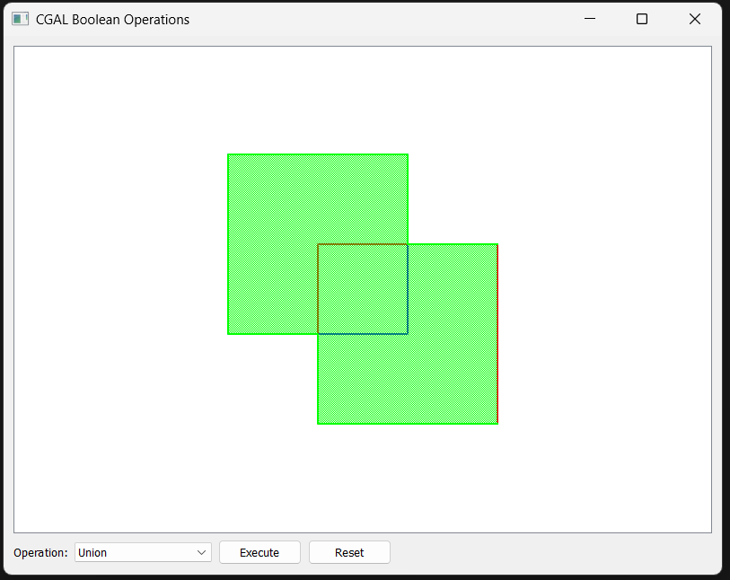
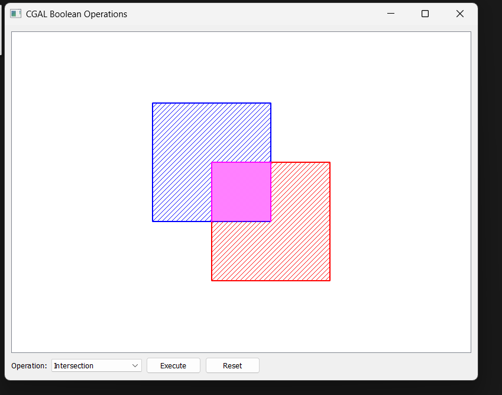
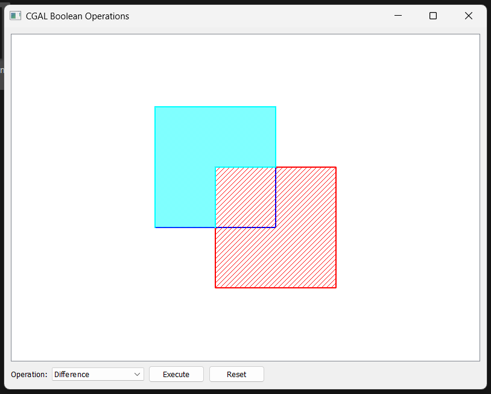

# Polygon Boolean Operations Visualizer


## Table of Contents

- [Overview](#overview)
- [Features](#features)
- [Demo](#demo)
- [Architecture](#architecture)
- [Getting Started](#getting-started)
  - [Prerequisites](#prerequisites)
  - [Building from Source](#building-from-source)
  - [Running](#running)
  - [Testing](#testing)
- [Usage](#usage)
- [Contributing](#contributing)
- [License](#license)
- [References](#references)

---

## Overview

**Polygon Boolean Operations Visualizer** is a cross-platform desktop application for visualizing and experimenting with Boolean operations (union, intersection, difference, symmetric difference) on 2D polygons. It leverages [CGAL](https://www.cgal.org/) for robust computational geometry and [Qt](https://www.qt.io/) for an interactive graphical interface.

## Features

- **Multiple Boolean Operations:** Union, intersection, difference, symmetric difference
- **Interactive Visualization:** Real-time, color-coded output
- **Exact Calculations:** Uses CGAL's exact geometric kernel
- **Cross-Platform:** Windows, macOS, Linux
- **Export Capability:** Save results as images or polygon data files

## Demo






**Video Demonstration:**  
<video src="resources/demovideos/Demovideo.mp4" controls width="600">
  Your browser does not support the video tag.  
  [Watch Demo Video](resources/demovideos/Demovideo.mp4)
</video>

## Architecture

- **Core Logic:** [`src/Booleanoperations.cpp`](src/Booleanoperations.cpp), [`include/BooleanOperations.h`](include/BooleanOperations.h)
- **GUI:** [`src/BooleanOperationsGUI.cpp`](src/BooleanOperationsGUI.cpp), [`include/BooleanOperationsGUI.h`](include/BooleanOperationsGUI.h)
- **Entry Point:** [`src/main.cpp`](src/main.cpp)
- **Documentation:** [`docs/index.md`](docs/index.md)
- **Resources:** [`resources/images/`](resources/images/), [`resources/demovideos/`](resources/demovideos/)

## Getting Started

### Prerequisites

- C++ compiler with C++17 support
- CMake 3.10 or higher
- Qt 5.12 or higher
- CGAL 5.0 or higher
- GMP and MPFR libraries (required by CGAL)

### Building from Source

#### Windows (using MSYS2/MinGW)

1. Install MSYS2 from [https://www.msys2.org/](https://www.msys2.org/)
2. Open MSYS2 terminal and install required packages:
   ```bash
   pacman -S mingw-w64-x86_64-gcc mingw-w64-x86_64-cmake mingw-w64-x86_64-qt5 mingw-w64-x86_64-cgal
   ```
3. Clone the repository:
   ```bash
   git clone https://github.com/yourusername/Polygon_Boolean_Operations_Visualizer.git
   cd Polygon_Boolean_Operations_Visualizer
   ```
4. Build the project:
   ```bash
   mkdir build
   cd build
   cmake ..
   make
   ```

#### Linux / macOS

1. Install dependencies using your package manager (e.g., `apt`, `brew`).
2. Follow steps 3 and 4 above.

### Running

After building, run the application:

```bash
./build/boolean_operations_gui.exe   # or ./boolean_operations_gui on Linux/macOS
```

### Testing

Unit tests are located in the [`tests/`](tests/) directory. To run tests (after building):

```bash
ctest --output-on-failure
```
or run the test binary directly if available.

## Usage

- Launch the application.
- Use the GUI to draw or import polygons.
- Select the desired Boolean operation.
- View results interactively and export as needed.

## Contributing

Contributions are welcome! Please see [CONTRIBUTING.md](CONTRIBUTING.md) for guidelines.

- Fork the repository
- Create a feature branch
- Commit your changes
- Open a pull request

## License

This project is licensed under the MIT License. See [LICENSE](LICENSE) for details.

## References

- [CGAL Documentation](https://doc.cgal.org/)
- [Qt Documentation](https://doc.qt.io/)
- [Project Documentation](docs/index.md)

---

**Main Files:**
- [src/Booleanoperations.cpp](src/Booleanoperations.cpp)
- [src/BooleanOperationsGUI.cpp](src/BooleanOperationsGUI.cpp)
- [src/main.cpp](src/main.cpp)
- [include/BooleanOperations.h](include/BooleanOperations.h)
- [include/BooleanOperationsGUI.h](include/BooleanOperationsGUI.h)
- [docs/index.md](docs/index.md)
- [resources/images/](resources/images/)
- [resources/demovideos/](resources/demovideos/)

**Contact:**  
For questions or support, please open an issue on GitHub.
